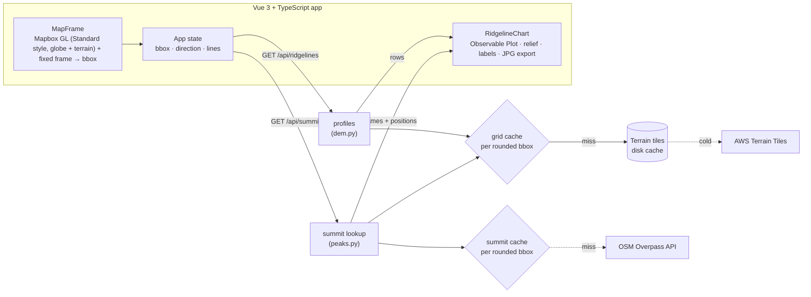

# Ridgeline Studio — concept

Turn any mountain area on a map into an "Unknown Pleasures"-style ridgeline poster: frame an area, the backend samples its terrain into stacked elevation profiles, the browser draws and styles them, and the result can be exported for print.

This folder contains a working prototype of the concept:

```
app/
├── backend/     FastAPI · elevation tiles → ridgeline profiles, OSM summit names
└── frontend/    Vue 3 + TypeScript + Vite · Mapbox GL globe framing, live poster preview, JPG export
```

## User flow

1. **Frame** — the map opens as a 3D globe on Mapbox's **Standard** style (`projection: "globe"`, night light preset — the dark, hillshaded "outdoors" look) with real terrain displacement; pan/zoom/rotate to find an area, then a fixed 5:4 frame marks the poster area (presets fly there directly). Camera pitch is locked to 0 so the frame always maps to a true rectangle on the ground; the terrain's 3D relief still reads clearly away from the globe's center, purely from the sphere's own curvature. At the zoom levels used to frame a mountain range the curvature is imperceptible, so framing feels like a flat map even though the projection never switches.
2. **Render** — the frame goes to two endpoints in parallel: ridgelines (drawn as soon as they arrive) and summit names (labels appear when the slower OpenStreetMap lookup finishes).
3. **Tune** — viewing direction and line count re-query ridgelines only (the elevation grid is cached, so this takes milliseconds); relief, labels and title are pure client-side re-styling.
4. **Export** — download a poster JPEG (chart + title block, built as SVG then rasterized client-side at 3x for print). Print/order flows are on the roadmap.

## Architecture



**Split of work.** The server does everything that needs raw elevation data: tile I/O, NumPy aggregation, and placing summits on the DEM. The client gets a compact matrix (`lines × samples` integers, ~150 KB gzipped at 100 × 360) and owns all visual decisions, so styling never costs a round trip.

**Why two endpoints.** Measured while building the prototype: ridgelines for a cached area take 7–100 ms, while the public Overpass API took 0.5–8 s for the same small query, at times answered HTTP 504 (overloaded), and a public mirror didn't answer within 30 s. Coupling them would make every render as slow as the slowest dependency; separating them keeps the core experience fast and lets labels fail gracefully.

## API

### `GET /api/ridgelines`

| Param | Default | Limits | Meaning |
|---|---|---|---|
| `west`, `south`, `east`, `north` | — | span ≤ 2.0° × 1.4°, ≥ 0.005° | Frame bounding box (WGS84) |
| `lines` | 100 | 16–240 | Number of ridgelines, far → near |
| `samples` | 360 | 64–1000 | Points per ridgeline |
| `direction` | `north` | north/east/south/west | Direction the viewer looks |

```json
{
  "bbox": [13.1536, 47.4462, 13.4264, 47.5936],
  "direction": "north",
  "min": 466, "max": 2415,
  "rows": [[512, 518, ...], ...],
  "meta": { "zoom": 13, "tiles": 42, "metres_per_px": 12.9, "elapsed_ms": 76 }
}
```

`rows[0]` is the far edge; each row runs left → right as the viewer sees it.

### `GET /api/summits`

Same frame parameters. Returns the highest named OSM peaks, spread apart so labels don't pile up:

```json
{ "summits": [{ "name": "Raucheck", "ele": 2430, "down": 0.3712, "across": 0.2941 }] }
```

`down`/`across` are fractions of the frame from the north and west edges, measured at the highest DEM pixel within 500 m of the OSM node. They are independent of direction and line count, so one lookup per frame serves every rendering; the client rotates them into the current view and snaps each label to the highest drawn point nearby. If Overpass fails the response is `{"summits": [], "error": "..."}` with `no-store`, and the next render retries.

Errors (both endpoints): `422` invalid, too large or too small area; `502` elevation tiles unreachable.

## Processing pipeline (`dem.py`)

1. **Zoom selection** — highest zoom (≤ 13, ~12 m/px) whose tile count fits a 64-tile budget; large frames automatically use coarser data.
2. **Mosaic + crop** — fetch Terrarium PNG tiles in parallel (disk + in-memory LRU cache), decode `R·256 + G + B/256 − 32768`, crop to the frame.
3. **Despike** — clamp single-pixel outliers (> 200 m beyond all 8 neighbours); the public tiles contain occasional bogus values (a 5,005 m pixel appeared near Kufstein).
4. **Cache the grid** per rounded bbox. Concurrent requests for the same frame share one computation (`cache.SharedCache`), so a fast direction switch while the first render is still running doesn't download tiles twice.
5. **Orient** — rotate/flip the grid so row 0 is the far edge for the chosen direction.
6. **Profiles** — split into `lines` bands; per band take column-bin maxima (keeps sharp summits) and average over the band's pixel rows (smooths noise). Vectorised with `np.maximum.reduceat`.

## Rendering (`RidgelineChart.vue`)

- One `areaY` (black fill) + `lineY` (white stroke) pair **per row, far → near**. Order matters: Plot groups marks by type when faceting, which breaks occlusion, so the prototype deliberately avoids facets.
- y is expressed in "line units" (row r sits on baseline −r) so relief is independent of the elevation range; peak height is kept constant in pixels when the line count changes.
- Space for labels is reserved up front so the chart doesn't jump when summits arrive; labels sit on top of all ridges.
- Export renders the chart and a title block as SVG, then rasterizes that to a canvas at 3x scale and saves it as a JPEG — vector text stays crisp up to that scale, and JPEG travels better than SVG for print/sharing services that expect a raster image.

## Scaling to a product

| Concern | Prototype | Production |
|---|---|---|
| Tile cache | local disk + LRU | object storage (S3/R2) in the same region as the API |
| Grid / summit caches | in memory per process, request coalescing | Redis or object storage shared by all instances; CDN in front of the cacheable GETs |
| Compute | a never-seen area needs its tile downloads (a few seconds); cached areas answer in milliseconds | stateless containers, autoscaled; cold cost is mostly tile fetches (≤ 64 × ~100 KB) and ~20 MB RAM per grid |
| Summits | public Overpass instance (slow, occasionally HTTP 504) | pre-extracted peak table from an OSM planet/regional extract (PostGIS), queried in milliseconds |
| Base map | OSM standard tiles | commercial tile provider (the OSM tile policy forbids heavy use) |
| Abuse | span limits | rate limiting per IP/account, request timeouts |

Heavier artefacts (print PDFs, plotter files) should be generated asynchronously: `POST /api/exports` → job queue → file in object storage → download link.

## Data and licensing

- **Elevation:** AWS Terrain Tiles aggregate SRTM, Copernicus/EU-DEM, national datasets and others; commercial use is allowed with source attribution (see the dataset's attribution list). For premium Alpine prints, national open DEMs (e.g. Austria's 10 m model on data.gv.at, CC BY 4.0) give sharper ridges; verify licence terms per country.
- **Summit names:** OpenStreetMap, ODbL. Credit "© OpenStreetMap contributors" on the poster or product page.
- **Design:** the ridgeline style is not protectable, but "Joy Division", "Unknown Pleasures" and the original cover artwork are, so don't use them in product naming or marketing.
- **Interactive basemap:** the framing map runs on Mapbox GL JS and the hosted **Standard** style — a proprietary, token-gated service (Mapbox's own terms, not open data), separate from the ridgeline pipeline itself. The backend's elevation sampling and summit names are unaffected and stay on the open AWS Terrain Tiles / OSM Overpass stack described above; only the browser's selection map depends on Mapbox. A generous free tier covers prototype use, but a real product needs a Mapbox account, a scoped production token, and a look at their pricing before launch.

## Roadmap

**MVP (this prototype)** — map framing, presets, direction/lines/relief/labels, JPG export.

**v1 — shareable & printable**
- Place search (geocoding) and shareable URLs (bbox + settings in the query string)
- Poster formats (A3/A2/50×70, portrait/landscape) driving the frame aspect ratio
- Print-ready export: server-side PDF (e.g. CairoSVG) with bleed and embedded fonts
- GPX upload: highlight a hiked route or race course across the ridgelines
- Custom text: title, subtitle, date, coordinates

**v2 — commerce & materials**
- Checkout + print-on-demand fulfilment API
- Accounts and saved designs
- **Plotter/laser export:** fills don't exist on a pen plotter, so hidden segments must be removed geometrically (clip each line against the union of nearer ridges, e.g. with Shapely) and paths optimised for travel
- B2B: bulk/branded editions for huts, tourism regions and races

## Running the prototype

```bash
# backend (Python 3.11+)
pip install -r app/backend/requirements.txt
uvicorn main:app --app-dir app/backend --port 8000

# frontend (Node 20+), proxies /api to :8000
npm --prefix app/frontend install
cp app/frontend/.env.local.example app/frontend/.env.local  # then paste in a Mapbox token
npm --prefix app/frontend run type-check  # vue-tsc, no emit
npm --prefix app/frontend run dev         # → http://localhost:5173
```

## Known limitations

- No antimeridian handling; latitude limited to ±85°.
- Summit names depend on the public Overpass API, which often answers HTTP 504 once and then succeeds; the backend retries busy responses (429/5xx) once, and if it still fails the poster renders without labels, shows a note, and the next render tries again.
- The first render of a never-seen area waits for tile downloads; repeated or nearby frames hit the caches.
- Caches live in one process, so they are lost on restart and not shared between workers.
- Very flat areas produce near-flat lines (relief is normalised to the frame's own elevation range).
- The map needs a Mapbox access token (`VITE_MAPBOX_TOKEN` in `app/frontend/.env.local`, gitignored — see `.env.local.example`) or it fails to load; a public (`pk.`) token is meant to be shipped in client code, but should still be scoped to your own domains in Mapbox's dashboard before going live.
- Mapbox GL JS is source-available under Mapbox's own license (not open-source) and its usage counts against your Mapbox account's map-load quota — check pricing before high traffic.
